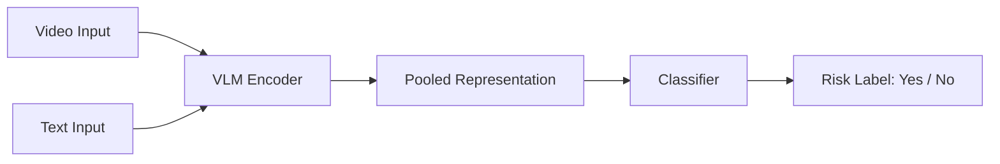

# 🚗 A Multimodal Vision-Language Model for Crash Risk Detection

## 🧠 Overview

This project presents a fine-tuned multimodal Vision-Language Model (VLM) designed to anticipate imminent crash risks based on short driving video clips and textual prompts.  
The core objective is to predict whether a traffic accident is likely to occur within the next 1–2 seconds after the observed segment.

Key Highlights:
- Combines visual (video) and textual (query) inputs using a VLM backbone.
- Operates in a Visual Question Answering (VQA) setup: given a short clip and a question, the model outputs a binary answer (e.g., "Yes" for crash risk, "No" for safe).
- Built upon the Hugging Face [`SmolVLM2-500M-Video-Instruct`](https://huggingface.co/HuggingFaceTB/SmolVLM2-500M-Video-Instruct) model.

---

## 🧩 Architecture



---

## ⚙️ Environment Setup

This project requires **Python 3.10.18** and is tested on **Windows 11**.  
Please make sure you have `conda` installed before proceeding.

### 🧾 Requirements

Install all required packages with:

```bash
pip install -r requirements.txt
```

### 🛠️ Setup Instructions

It is recommended to use a dedicated conda environment:

```bash
conda create --name your_env python=3.10.18
conda activate your_env
pip install -r requirements.txt
```

---

## 🗂️ Dataset Structure

To train the model, your dataset directory should follow the structure below.  
You may use the provided `dataset_script.py` to automatically generate annotation files (in `.jsonl` format), or modify the script to fit your own dataset layout.

### 📝 Annotation Format

Each `.jsonl` file (e.g., `train.jsonl`) contains one JSON object per line.  
Each entry should include:
- `video`: video file name.
- `text`: the input text prompt (e.g., “Is a vehicle collision likely to happen within 1 to 2 seconds?(0: No, 1: Yes)”).
- `label`: the ground truth answer (typically `1` or `0`).

Example:
```jsonl
{"video": "video1.mp4", "text": "Is a vehicle collision likely to happen within 1 to 2 seconds?(0: No, 1: Yes)", "label": 1}
{"video": "video2.mp4", "text": "Is a vehicle collision likely to happen within 1 to 2 seconds?(0: No, 1: Yes)", "label": 0}
...
```

### 📁 Folder Structure

```
Dataset/
├── dataset_script.py
├── train/
│   ├── video1.mp4
│   ├── video2.mp4
│   └── ...
├── val/
├── test/
├── train.jsonl
├── val.jsonl
└── test.jsonl
```

> 🔧 Note: 
> 1. Put `dataset_script.py` inside your dataset directory.
> 2. Remember to generate the `.jsonl` label files by yourself.

---

## 🚀 Usage

### 🏋️‍♂️ Training

To train the model, use either of the following methods:

**Option 1: Manual Command**
```bash
python vision/finetuning/smolvlm2_video_FT_strategy3.py --dataset freeway --epoch 3
```

Available arguments:
- `--dataset`: name of the dataset folder (e.g., `freeway`, `road`)
- `--epoch`: number of training epochs (e.g., `3`)

**Option 2: Batch Script**
```bash
run.bat
```
> 📌 Make sure to edit `run.bat` to set your dataset and training parameters before executing.

---

### 🔍 Inference

After training, you can run inference on test videos to get predictions:

**Option 1: Manual Command**
```bash
python vision/finetuning/custom_infer.py --dataset freeway --epoch 3
```

> 💡 Note: This command automatically switches to inference mode after training if the epoch count matches a checkpoint.

**Option 2: Batch Script**
```bash
infer.bat
```
> 📌 Edit `infer.bat` to match your trained model path and dataset location.
